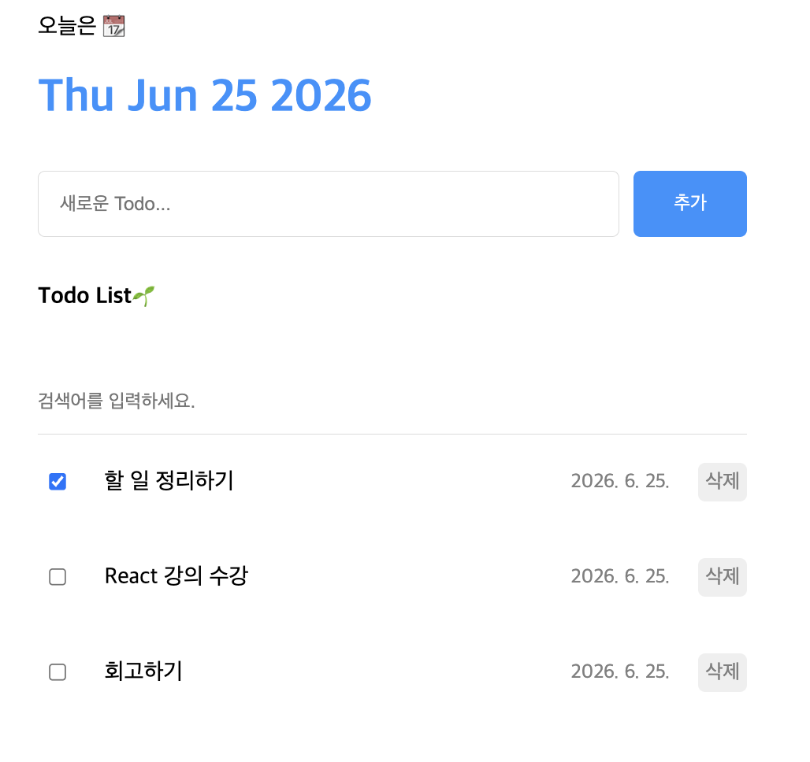

# Todo List

React 강의 섹션 9에서 배운 내용을 바탕으로 만든 Todo List 앱입니다.

## 사용 기술

- React 19
- Vite
- useState, useRef
- Javascript

## 주요 기능

- 할 일 추가 (엔터 입력 시에도 추가 가능)
- 완료 여부 체크
- 할 일 삭제
- 키워드 검색(영어는 toLowerCase() 이용해서 대소문자 구분 없이 검색 가능하게 함)

## 사용한 기술

- **useState**: todo 목록 상태 관리 및 CRUD 구현
- **useRef**: 새 항목 추가 시 id 값 관리 (리렌더 없이 값 유지)
- **라이프사이클**: 컴포넌트 마운트/업데이트/언마운트 흐름 이해

## 실행 방법

```bash
npm install
npm run dev
```

## 개선 사항

- Typescript 사용해서 구현해보기
- 할 일 날짜 설정하기
- localStorage 저장


